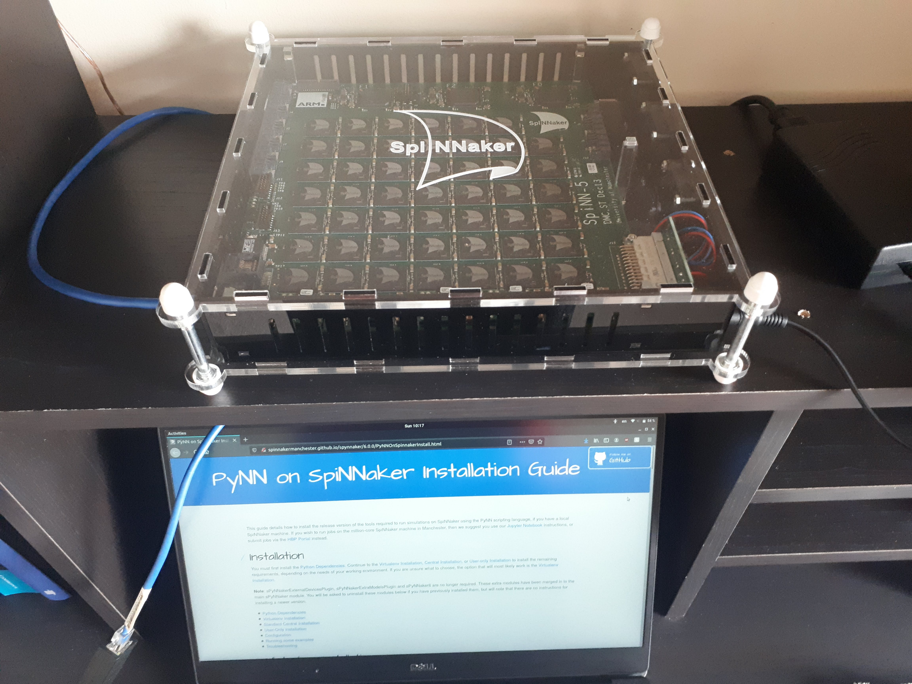

# Welcome to a tutorial on SpiNNaker

These pages provide a walkthrough on the configuration of a simulation environment based on the SpiNNaker neuromorphic board. The instructions mostly pertain to the use of PyNN with the 48-chip SpiNNaker #1 board (i.e. `spinn5`).

Complementary information regarding the 4-chip version can be found in the official [SpiNNaker Installation Guide](http://spinnakermanchester.github.io/spynnaker/6.0.0/PyNNOnSpinnakerInstall.html). This tutorial provides a condensed version of the instructions found on those pages targeting Ubuntu workspaces (Ubuntu 18.04 LTS).

## Contents

- [Environment setup](./installation/setup.md)
- [SpiNNaker in the context of DBS](./dbs/overview.md)
- [SpiNNaker for robotics](./robotics/overview.md)

## About

This tutorial stems from research collaboration at the University of Toronto at the intersection of computational neuroscience and robotics. While currently under development, these tutorial pages aim to:

- [ ] provide a *getting-started* guide on how to use the SpiNNaker board with PyNN
- [ ] offer some examples of the modelling advantages (and limitations) of the SpiNNaker #1 system
- [ ] explore closed-loop computational neuroscience with applications to deep brain stimulation (DBS)
- [ ] explore the integration of the SpiNNaker system with robotic tools (e.g. ROS, NRP)

## Contact
